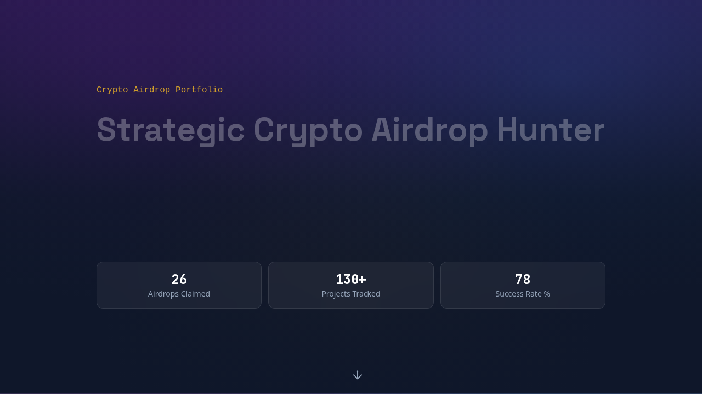
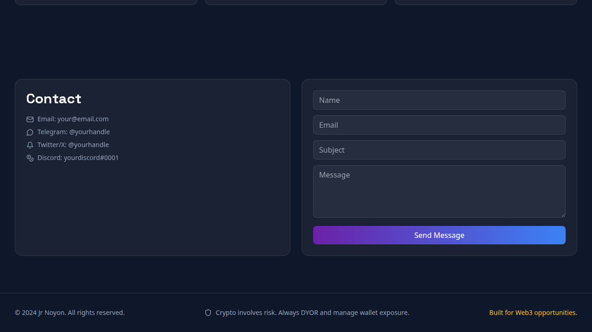

# 🚀 Jr Noyon — Crypto Airdrop Portfolio

> Strategic Crypto Airdrop Hunter portfolio built with **Next.js 14 + TypeScript + Tailwind + Framer Motion**.

<p align="left">
  
  
  
  
  
</p>

## 🌐 Live Demo
- **Website:** https://mhnoyon8.github.io/jr-noyon-airdrop-portfolio/
- **Repo:** https://github.com/mhnoyon8/jr-noyon-airdrop-portfolio

---

## ✨ Highlights
- Dark, crypto-native visual language
- Glassmorphism cards + glow interactions
- Animated hero + reveal transitions
- Mobile-first responsive layout
- SEO + OpenGraph + custom favicon
- Static-export ready for GitHub Pages

---

## 🧱 Tech Stack
- **Framework:** Next.js 14 (App Router)
- **Language:** TypeScript
- **Styling:** Tailwind CSS
- **Animations:** Framer Motion
- **Icons:** Lucide React

---

## ⚡ Quick Start
```bash
npm install
npm run dev
```
Open: `http://localhost:3000`

### Production Build
```bash
npm run build
npm run start
```

---

## 📁 Project Structure
```text
jr-noyon-airdrop-portfolio/
├── app/
│   ├── globals.css
│   ├── layout.tsx
│   └── page.tsx
├── public/
│   ├── favicon.svg
│   └── previews/
│       ├── hero-preview.png
│       ├── bottom-preview.png
│       └── live-preview.png
├── docs/                 # static export for GitHub Pages
├── package.json
├── tailwind.config.ts
├── tsconfig.json
└── README.md
```

---

## 🎛️ Customization Map
- **Theme colors & shadows:** `tailwind.config.ts`
- **Sections/content:** `app/page.tsx`
- **SEO + OG + favicon:** `app/layout.tsx`
- **Global utility styles:** `app/globals.css`

---

## 🖼️ Preview
### Hero


### Bottom Section


### Live Snapshot


---

## 🎯 Use Cases
1. **Personal Crypto Portfolio** — track record + strategy showcase
2. **Airdrop Consulting Landing Page** — lead capture + CTA flow
3. **Community Credibility Hub** — proof-of-work and public positioning
4. **Service Showcase Site** — consultation, wallet security, planning
5. **Content/Insights Starter** — airdrop blog and educational angle

---

## 🚀 Deploy (Vercel)
1. Push project to GitHub.
2. Open https://vercel.com/new and import the repo.
3. Framework preset: **Next.js** (auto-detected).
4. Deploy.
5. (Optional) Add custom domain in **Project Settings → Domains**.

## 🚀 Deploy (GitHub Pages)
This repo is configured with static export flow (`docs/` output). Push to `main` and ensure Pages source points to `/docs`.

---

## 📌 Roadmap (Suggested)
- [ ] Add multilingual content (BN/EN toggle)
- [ ] Add CMS-backed blog posts
- [ ] Add analytics dashboard section
- [ ] Add contact form backend (Formspree/Resend)
- [ ] Add Lighthouse CI check

---

## ⚠️ Disclaimer
Crypto is volatile and high risk. Always DYOR (Do Your Own Research), use secure wallet practices, and never risk funds you cannot afford to lose.

---

## 📄 License
For personal/portfolio use. Add your preferred open-source license if publishing for reuse.
